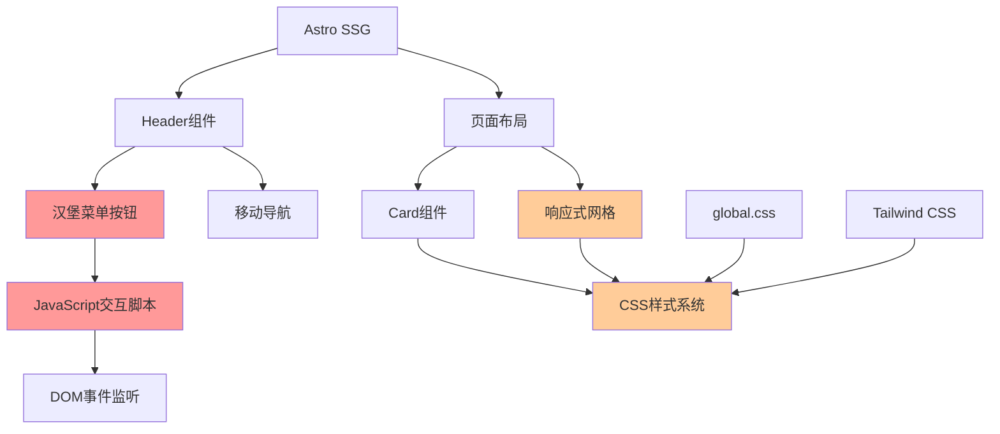

# Astro博客网站移动端交互问题修复设计

## 项目概述

J.Cooper-s-Log是一个基于Astro框架构建的静态博客网站，目前在移动端存在以下两个关键问题：
1. **汉堡菜单无法交互** - 移动端导航菜单按钮点击无响应
2. **部分页面卡片显示不正常** - 响应式布局在移动设备上出现样式错乱

本设计文档将深入分析问题根源，并提供完整的修复方案。

## 技术架构分析

### 当前技术栈
- **前端框架**: Astro v5.6.2 (静态站点生成)
- **样式框架**: Tailwind CSS v3.4.1 + 自定义CSS
- **组件化**: Astro组件 (.astro文件)
- **交互逻辑**: 原生JavaScript (客户端脚本)

### 架构图



## 问题分析

### 问题1: 汉堡菜单无法交互

#### 根本原因分析

1. **JavaScript执行时机问题**
   - Astro采用岛屿架构，客户端脚本可能在DOM完全渲染前执行
   - `DOMContentLoaded`事件监听器可能无法正确绑定到动态生成的元素

2. **元素选择器失效**
   - 移动端特定的CSS媒体查询可能影响元素的可见性
   - 样式层级冲突导致按钮无法正确响应点击事件

3. **事件传播阻塞**
   - CSS样式中的`pointer-events`属性可能被意外设置
   - Z-index层级问题导致其他元素遮挡按钮

#### 技术细节

```typescript
// 当前Header.astro中的脚本执行逻辑
document.addEventListener('DOMContentLoaded', () => {
    const mobileMenuToggle = document.querySelector('.mobile-menu-toggle');
    // 可能存在时机问题，元素尚未完全渲染
});
```

### 问题2: 移动端卡片显示异常

#### 根本原因分析

1. **响应式布局断点冲突**
   - CSS Grid布局在小屏幕下未正确切换到单列布局
   - 卡片最小宽度设置与容器宽度存在冲突

2. **CSS变量继承问题**
   - 暗色主题下某些CSS变量未正确传递到卡片组件
   - 边框和阴影效果在移动端显示异常

3. **内容溢出处理不当**
   - 长文本内容在移动端未正确截断或换行
   - 图片缩放比例在小屏幕下失调

#### 关键样式问题

```css
/* 当前有问题的样式 */
.posts-grid {
    display: grid;
    grid-template-columns: repeat(auto-fit, minmax(300px, 1fr));
    /* minmax(300px, 1fr) 在小于300px的屏幕上会造成溢出 */
}
```

## 修复方案设计

### 解决方案1: 汉堡菜单交互修复

#### 1.1 增强JavaScript执行可靠性

```typescript
// 新的脚本执行策略
function initMobileMenu() {
    const mobileMenuToggle = document.querySelector('.mobile-menu-toggle');
    const mobileNav = document.querySelector('.nav-mobile');
    const mobileBackdrop = document.querySelector('.mobile-backdrop');
    
    // 添加元素存在性检查和重试机制
    if (!mobileMenuToggle || !mobileNav || !mobileBackdrop) {
        setTimeout(initMobileMenu, 100); // 100ms后重试
        return;
    }
    
    // 绑定事件处理器...
}

// 多重初始化策略
document.addEventListener('DOMContentLoaded', initMobileMenu);
document.addEventListener('astro:page-load', initMobileMenu); // Astro特定事件
```

#### 1.2 CSS样式层修复

```css
/* 确保按钮可点击性 */
.mobile-menu-toggle {
    position: relative;
    z-index: 1000;
    pointer-events: auto !important;
    touch-action: manipulation; /* 优化移动端触摸 */
}

/* 增加触摸目标大小 */
.mobile-menu-toggle {
    min-width: 44px;
    min-height: 44px;
    /* 符合移动端可访问性标准 */
}
```

#### 1.3 添加调试和错误处理

```typescript
function toggleMobileMenu() {
    console.log('Menu toggle clicked'); // 调试日志
    
    try {
        // 原有逻辑...
    } catch (error) {
        console.error('Mobile menu toggle error:', error);
        // 降级处理逻辑
    }
}
```

### 解决方案2: 移动端卡片布局修复

#### 2.1 响应式网格系统重构

```css
/* 修复后的网格布局 */
.posts-grid {
    display: grid;
    grid-template-columns: 1fr; /* 移动端默认单列 */
    gap: 1rem;
}

@media (min-width: 480px) {
    .posts-grid {
        grid-template-columns: repeat(auto-fit, minmax(280px, 1fr));
    }
}

@media (min-width: 768px) {
    .posts-grid {
        grid-template-columns: repeat(auto-fit, minmax(300px, 1fr));
        gap: 1.5rem;
    }
}
```

#### 2.2 卡片组件优化

```css
/* 移动端卡片样式优化 */
.post-card {
    width: 100%;
    max-width: 100%;
    box-sizing: border-box;
    overflow: hidden; /* 防止内容溢出 */
}

@media (max-width: 480px) {
    .post-card {
        padding: 1rem;
        margin: 0 0.5rem;
    }
    
    .post-title {
        font-size: 1.1rem;
        line-height: 1.4;
    }
    
    .post-description {
        font-size: 0.9rem;
        -webkit-line-clamp: 2; /* 移动端减少显示行数 */
    }
}
```

#### 2.3 CSS变量系统完善

```css
/* 确保移动端主题变量正确应用 */
:root {
    --border-color: rgba(0, 0, 0, 0.1);
    --card-bg: var(--bg-accent);
    --card-shadow: 0 2px 8px rgba(0, 0, 0, 0.1);
}

[data-theme="dark"] {
    --border-color: rgba(255, 255, 255, 0.1);
    --card-shadow: 0 2px 8px rgba(0, 0, 0, 0.3);
}

@media (max-width: 768px) {
    :root {
        --card-shadow: 0 1px 4px rgba(0, 0, 0, 0.08);
    }
    
    [data-theme="dark"] {
        --card-shadow: 0 1px 4px rgba(0, 0, 0, 0.4);
    }
}
```

## 实施策略

### 阶段1: 汉堡菜单修复 (优先级: 高)

1. **JavaScript重构**
   - 重写移动菜单初始化逻辑
   - 添加多重初始化策略
   - 增强错误处理和调试能力

2. **CSS样式修正**
   - 修复按钮层级和可点击性
   - 优化触摸交互体验
   - 确保跨设备兼容性

3. **测试验证**
   - 在多种移动设备上测试菜单功能
   - 验证不同屏幕尺寸下的交互效果

### 阶段2: 卡片布局优化 (优先级: 中)

1. **响应式系统重构**
   - 重新设计断点策略
   - 优化网格布局算法
   - 完善CSS变量系统

2. **组件样式调优**
   - 优化卡片在移动端的显示效果
   - 改进文本截断和图片适配
   - 增强主题切换的视觉一致性

3. **性能优化**
   - 减少移动端不必要的CSS加载
   - 优化动画和过渡效果
   - 提升渲染性能

### 阶段3: 全面测试和优化 (优先级: 中)

1. **跨设备测试**
   - iOS Safari、Android Chrome等主流移动浏览器
   - 不同屏幕尺寸和分辨率适配
   - 横竖屏切换测试

2. **可访问性增强**
   - 键盘导航支持
   - 屏幕阅读器兼容性
   - 触摸目标大小优化

3. **性能监控**
   - 移动端加载速度优化
   - 交互响应时间监测
   - 内存使用量控制

## 技术风险评估

### 高风险项
1. **Astro岛屿架构兼容性** - 客户端脚本与SSG的集成可能存在时序问题
2. **CSS变量继承** - 复杂的主题系统可能在某些浏览器中表现不一致

### 中风险项  
1. **响应式断点重构** - 可能影响现有桌面端布局
2. **触摸事件处理** - 需要确保与原生滚动行为兼容

### 低风险项
1. **样式微调** - 卡片间距、字体大小等视觉优化
2. **调试代码添加** - 不会影响生产环境功能

## 验收标准

### 功能验收
- [ ] 汉堡菜单在所有主流移动设备上可正常点击和切换
- [ ] 移动导航菜单能正确展开和收起
- [ ] 卡片布局在移动端显示正常，无溢出或错位

### 性能验收  
- [ ] 移动端首屏加载时间不超过3秒
- [ ] 菜单切换动画流畅，无卡顿现象
- [ ] 页面滚动时交互响应及时

### 兼容性验收
- [ ] iOS Safari 14+、Android Chrome 90+正常运行
- [ ] 屏幕宽度320px-768px范围内显示正常
- [ ] 暗色/亮色主题切换无样式异常

### 可访问性验收
- [ ] 移动端按钮触摸目标不小于44x44px
- [ ] 支持键盘导航（Tab键遍历）
- [ ] 屏幕阅读器能正确识别菜单状态

通过以上设计方案的实施，将彻底解决Astro博客网站在移动端的交互问题，提升用户体验和网站可用性。