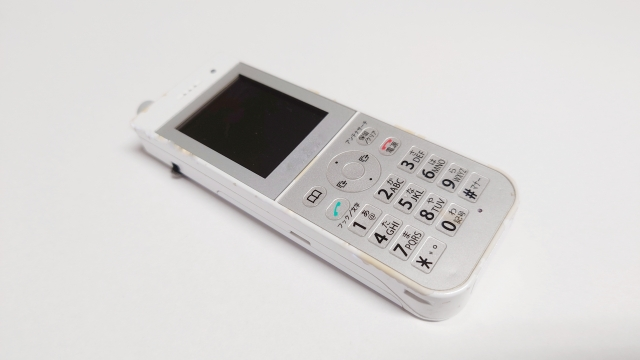

### 导言

*闹钟 (Alarm) 想必大家都不陌生, 对于社畜来说, 基本上每天都要接触, 不论是早上起床还是中午午休, 这个小东西都发挥着不错的效果~*

*还记得苹果默认闹钟的 "叮叮叮~" be like.*

<audio controls src="/audio/apple-alarm-sound.mp3" title="Title"></audio>

*多么悦耳呵呵呵, 开个玩笑.*

### 为什么要关掉闹钟?

如博客标题所见, 在最近的一个月里面, 我关闭了日常生活中的所有的闹钟, 可能也是受到来自[r/productivity](https://www.reddit.com/r/productivity/)的这篇[博客](https://www.reddit.com/r/productivity/comments/dxm6vw/snoozing_the_alarm_can_harm_you/)的影响吧,对于社畜来说, 这个可以让你在工作日前一天熬夜完之后第二天能够如期醒来.(周五晚上除外 lol).

比如拿我军训那段时间来举例,每天需要六点钟起床,那段时间是痛苦的,但是还是让我如期完成了当时学校军训的任务;

所以这东西只是把它当作一个一次性工具就够了,因为如果一直使用的话我认为对个人长期来说还是有一定影响的,

自然的睡眠被一些外界可抗因素影响,身体的平衡被打破, 这听起来不是很好, 对吧? 我们要让自己的身体里面的"闹钟"来叫醒我们,

正是所谓的--**生物钟**.

### 闹钟与我的轶闻

最早大概是小学的时候吧, 接触闹钟还是在婆婆的那个小灵通上面, 当时觉得这小玩意是不是和电视里面的闹钟一样, 感觉这个小玩意很高级, 觉得自己有了这个会厉害哈哈哈, 小孩都是这样的, 那个小灵通还内置了一个java游戏, 打高尔夫球的, 现在看来很无聊了, 但是那时候就是我的全部娱乐方式了.

大概到了初中还是高中, 偷偷拿了老妈之前的一个小三星手机当闹钟. 好像还可以完水果忍者, 现在也不知去哪了, 可能被拿去换脸盆了......

再到后面高考那会吧, 由于公平的高考马上到来, 自己去精品店买了一个蛮精致的闹钟,也是为了督促自己学习,现在想起来那段时间自己还是蛮努力的(假努力), 最后的结果和预期也出入不大. 总之闹钟在我大学之前还是使用的频率蛮高的.

大学之后由于**可能相对比较**自由, 这玩意的使用的场景随之也减少了.

直到现在工作和以后,可能也是由于工作时间比较自由这一点,不用每天打卡,闹钟对我来说也没有存在的必要了,只是偶尔**坐火车提醒到站**(列车员其实也会提醒)或者其他紧急情况需要使用.

### 开启了我的生物钟?

这个问题其实只要稍微想一想就很好理解吧,闹钟会打破我们身体的规律,像我们平时熬夜之后第二天是不是通常醒的就比较晚,然后再加上闹钟强行把我们叫醒,这样就可能导致第二天会觉得没有精神. 这样听起来很正确对吧.

但是我觉得这完全是**扯淡**, 我们的身体有自己的规律, 你睡的再晚, 第二天你体内的生物钟还是会把你叫醒的. 不用闹钟, 你也不会赖床,至少对我来说是这样的. 我前一天晚上睡得再晚, 第二天也是固定的时间醒来, 最多你会赖一会床或者没啥事睡个回笼觉, 完全取决于你自己.

关掉闹钟之后, 自然醒的感觉, 习惯之后还是很舒服的, 没有约束, 睡晚一点睡早一点完全取决于你身体的选择, 很舒服~

### 后记

闹钟其实只是一个提醒我们的工具,不要让他来约束你,让你成为闹钟的奴隶,与手机类比亦是如此.

**总之**,少用闹钟,让自己的身体少一点负担, 当然也不要太晚睡熬夜, 争取做到早睡早起.

(完) 编辑于 Sun Apr 6 19:40:35 PDT 2025

再次编辑于 Mon Apr 14 23:59:08 PDT 2025
