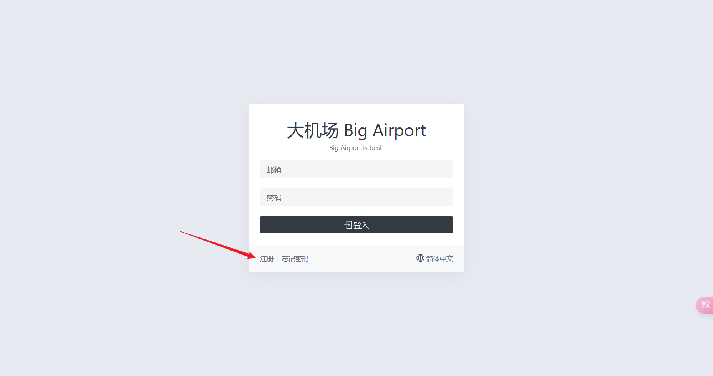
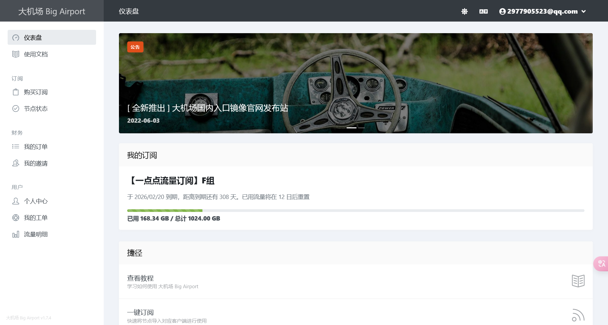
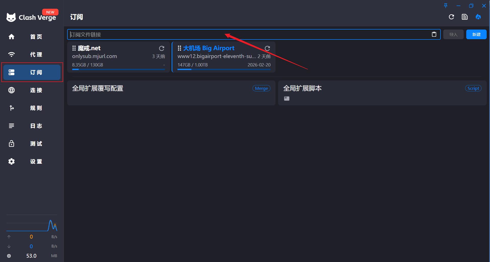
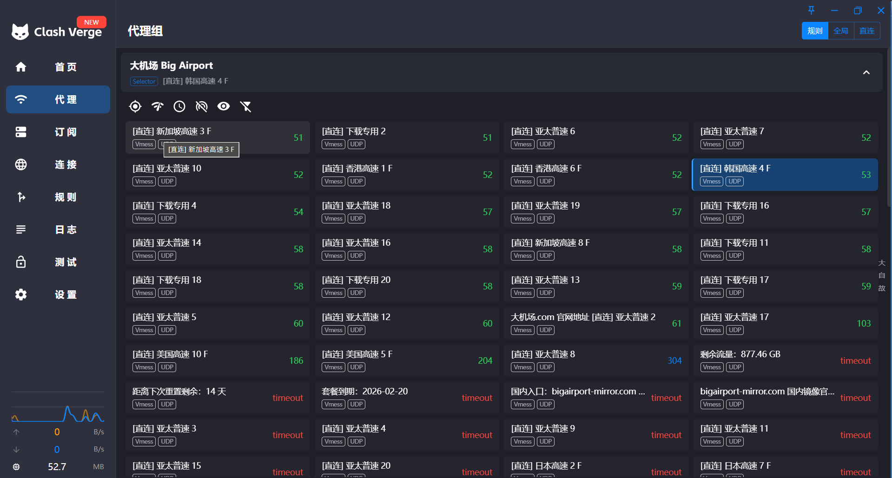

## 前言

笔者是从六七年前开始了解科学上网的, 最早是用来看PH, 后面也慢慢成为一个获取信息的渠道.

内网信息封闭, 外网信息又太嘈杂了, 不过一直在内网也很难获取到一些有价值的东西.

写这个教程的另一个原因是笔者身边很多人还不怎么了解有些人想但是不会, 我觉得是有写一点东西的必要了.

---

## 何为"翻墙"

首先你要明白所谓的"翻墙"原理是什么?

其实主要的就是两种方式: VPN和代理.

### VPN

**原理** ：在你的设备和VPN服务器之间建立一条 **加密隧道** 。GFW无法读取你真实访问的内容，只能看到你“访问了一个VPN服务器”。

---

### 代理

**原理** ：你不直接访问目标网站，而是让一个代理服务器帮你访问，再把内容转发给你。

**分类** ：

HTTP代理：仅转发网页内容，常被墙识别。

SOCKS5代理：可以转发所有网络请求（浏览器、聊天工具、FTP等），灵活性更高。

---

## 方法

这里介绍笔者自己用的两个机场, 一个是最早使用的[大机场](https://bigairport-mirror.com/), 此网址为大机场的镜像网址, 由于大陆DNS污染, 可以多试几个网址登录.

首先打开网站, 选择一个可以进入的官网, 如果是第一次使用可以注册一个帐号;

填入收码邮箱和密码即可(笔者已经注册过了就直接登录)

然后就可以购买订阅(4.9的就够用了), 得到一个订阅地址.

接下来我们需要下载一些**代理客户端**来完成"翻墙".

可以下载"查看教程"里面推荐的客户端(当然要更具自己的系统来选择), 也可以自己下载其他客户端, 这里笔者使用的是Minomo和[Clash Verge](https://github.com/clash-verge-rev/clash-verge-rev/releases/tag/v2.2.3).

下载完成之后就可以导入订阅然后使用了~

根据网速选择合适的节点连接使用

*大机场虽然量大便宜但是我用下来还是觉得不稳定,故找了一家其他的机场来作为备用 [魔戒](https://mojie.me/#/dashboard), 使用方法和上面一模一样, 这里就不赘述了,值得一提的是, 魔戒是按量计费的, 适合不怎么使用VPN的用户.*

---

## 后记

这就是我这几年科学上网的两大主要工具, 其他的如果有需要可以看看这个[博客](https://clashx.pro/)来获取你需要的"工具".

'*Panem et circenses*' 

-出自罗马诗人 Juvenal 的《讽刺诗》中的一段, 

英文是:

***'Give them bread and circuses, and they will never revolt.'***

(完) 编辑于

###### Fri Apr 18 16:19:18 CST 2025
